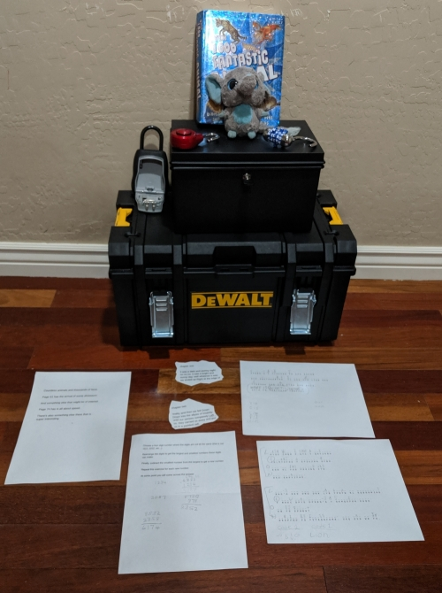
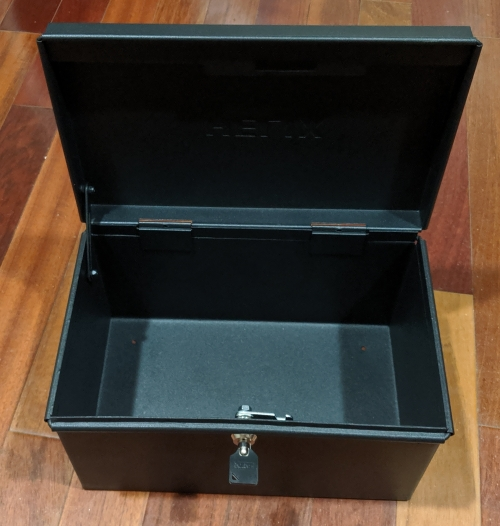
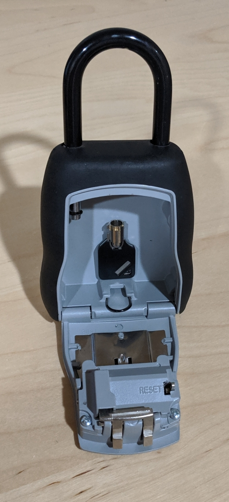
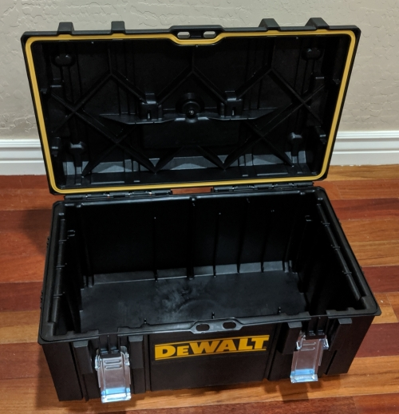
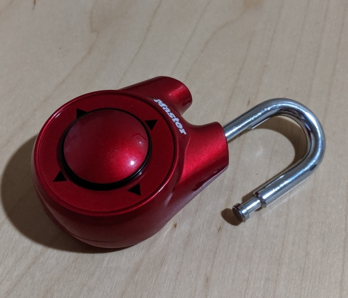
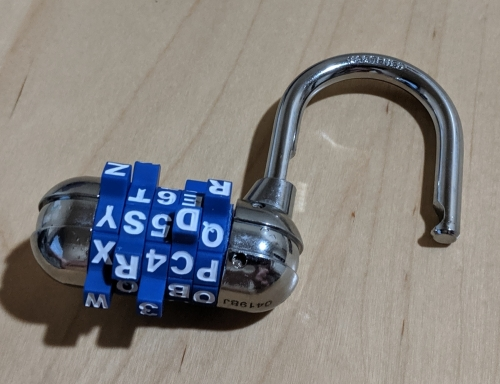

# Mountain Lion Club

This is the first puzzle that was created. It was completed and went through its first run on Sunday 6-Oct-2019.

---

## Components

- Dewalt Tough System DS 300 Toolbox
  - $45 Home Depot (Oct-2019)
- Speed Dial Master Lock
  - $8 Hope Depot (Oct-2019)
- Word Combination Master Lock
  - $8 Hope Depot (Oct-2019)
- High Security Deed Box
  - $40 Container Store (Oct-2019)
- Lockbox
  - $20 to $25 on Amazon

---

## The Setup

The components:

The stuffed toy...

...is placed inside the deed box...

...and locked with a key which is placed in the lockbox.

The clue sheet for the lockbox is printed out and placed inside the toolbox along with the deed box and the lockbox.

The Toolbox was then locked with both the Speed Dial Lock...

...and Word Combo Lock.

The clues for the Speed Dial Lock were placed inside a book between specific pages.

The clue page to find the Speed Dial clues and the Cryptograms were then given to the participants.

---

## The Game

It took our two participants about an hour to make their way through to the end of the game.

## Facilitating

[Instructions for Facilitating this game](https://github.com/guyellis/free-the-prisoner/tree/master/puzzles/mountain-lion-cub)

---

## Improvements

Create an [issue here](https://github.com/guyellis/free-the-prisoner/issues).

---
